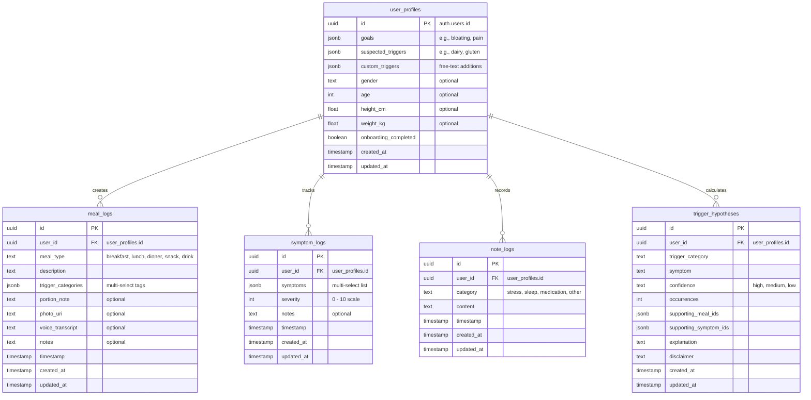

# GutSense — Codebase Summary & Architecture Overview

> **Last Updated:** June 6, 2026

This document summarizes the codebase structure, design principles, and business rules of **GutSense**, a mobile-first IBS (Irritable Bowel Syndrome) diary and correlation tracking app.

---

## 1. Product Concept & Core Value
GutSense is designed to help users identify personal dietary triggers for IBS and digestive issues with minimal friction. Instead of manually cross-referencing past meals with subsequent discomfort, the app uses a **deterministic temporal correlation engine** to match symptom occurrences to food logs.

### Primary Objectives
* **Frictionless Logging:** Meals, symptoms, and contextual notes (sleep, stress, medications) can be logged in a few taps.
* **Empowering Doctor Conversations:** Clear, confidence-tiered insights supported by visual logs, providing objective data for gastroenterologists or dietitians.
* **Deterministic Insights:** Hypotheses are generated client-side based on exact temporal associations without third-party LLM dependencies.
* **Medical Safeguards:** Prominent disclaimers stating the app does not diagnose, treat, or replace professional advice.

---

## 2. Technical Stack
The app is constructed with a modern, portable, and decoupled architecture:

| Component | Technology | Description |
| :--- | :--- | :--- |
| **Framework** | **React Native + Expo SDK 54** | Cross-platform runtime targeting web-first, iOS, and Android. |
| **Navigation** | **Expo Router 6** | File-system-based routing with tab navigation (`Today`, `Timeline`, `Insights`, `Charts`) and native stack modals. |
| **Backend** | **Supabase** | Handles User Authentication, Relational Postgres Storage, and Row Level Security (RLS). |
| **Storage** | **AsyncStorage** | Persists local session data and the onboarding "seen" welcome flag. |
| **Styling** | **React Native StyleSheet** | Scoped, component-level styles enforcing the predefined green/blue/gold color palette. |
| **Icons** | **Lucide React Native** | Consistent vector styling using `lucide-react-native`. |

---

## 3. Database Architecture (Supabase / Postgres)
The application relies entirely on Supabase for persistence. Row Level Security (RLS) is strictly configured so that all CRUD operations filter by `auth.uid() = user_id`.

---

## 4. Key Business & Routing Rules
The codebase strictly implements and enforces several business policies described in the PRD:

1. **Onboarding Gate:** The root layout redirects un-onboarded users directly to the `/welcome` carousel and `/onboarding` setup screens before letting them access the tabs.
2. **7-Day Edit Window:** Historical entries older than 7 days are locked from being modified (`isEditLocked` helper in `DayLogsModal`), displaying a lock icon. However, **deletion remains active** at any age.
3. **Correlation Engine Parameters:**
   * **Temporal Window:** Symptoms occurring within **6 hours** after a meal containing a trigger tag are correlated.
   * **Min Threshold:** A hypothesis is only surfaced if there are **at least 2 co-occurrences**.
   * **Confidence Tiers:**
     * **High:** 5+ correlated occurrences
     * **Medium:** 3–4 correlated occurrences
     * **Low:** 2 correlated occurrences
4. **Historical Edits Constraint:** When editing historical records, the original timestamp is preserved.

---

## 5. Directory Mapping & Key Modules

* **`app/`**: Contains route targets. `index.tsx` functions as the traffic controller routing to welcome, onboarding, or the tabs.
* **`app/(tabs)/`**:
  * `index.tsx` (Today): Displays a 24-hour feed with pull-to-refresh, reward banners, progress counts, and direct action triggers.
  * `timeline.tsx` (Calendar): Renders the monthly layout showing green dots for days with logged entries and triggers a bottom-sheet summary modal.
  * `insights.tsx` (Insights): Performs rolling 14-day analysis, rendering hypothesis cards sorted by strength of correlation.
  * `charts.tsx` (Charts): Draws 7-day visualizations (Meals/Symptoms per day, Top Symptoms, Top Triggers).
* **`components/`**: Houses presentational UI elements:
  * `DateTimePicker.tsx`: Standard unified timepicker.
  * `MonthCalendar.tsx`: The month-grid navigator (no internal business logic).
  * `DayLogsModal.tsx`: Slide-up sheet displaying specific day logs, enforcing the edit-lock.
* **`services/`**: Core logic layer:
  * `database.ts`: Single-point-of-contact for the Supabase client.
  * `correlations.ts`: Logic parsing the 6-hour window and returning the confidence-evaluated correlations.
* **`lib/`**: Singletons and configuration values:
  * `supabase.ts`: Clientside Supabase initialization.
  * `auth.tsx`: React auth contexts, session hooks, and auth state listeners.
  * `constants.ts`: The source-of-truth configuration for color tokens, meal choices, and symptom lists.

---

## 6. Testing Strategy
* **Mocks Setup:** Mocks for Expo Router, Supabase Client, and Database services are centralized within `__tests__/helpers/`.
* **Coverage Scope:** Focuses heavily on the core logic engines (`correlations.test.ts`), database functions (`database.test.ts`), and key screen logic files verifying that the UI updates, navigation triggers, and state refreshes correctly upon interaction.
