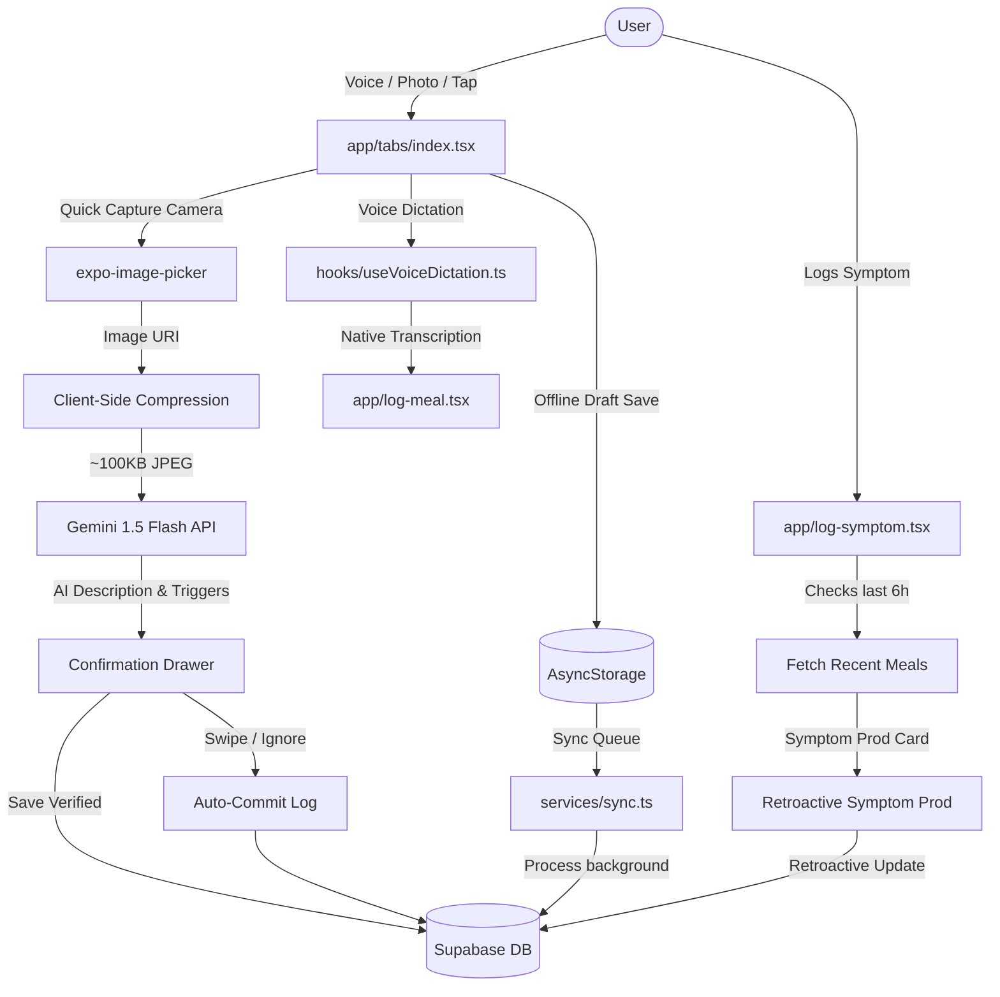

# Frictionless Logging: Detailed Implementation & Execution Plan

**Last Updated:** June 7, 2026

This document outlines the engineering and product-level execution plan for implementing the **Frictionless Logging** feature in **GutSense**. It serves as a technical blueprint, translating the brainstorms, failure modes, and mitigation strategies into concrete architectural layers and development tasks.

---

## 1. Guiding Philosophy: Friction Removal Priority & Directional Correctness

As established in the mitigation plan, our core guiding principle is that **friction removal takes priority over 100% correctness**:
* While the system must always *aim* for 100% correctness in meal and ingredient identification, it must never enforce correctness at the expense of user effort.
* When forced to choose between forcing validation (high friction) and logging a potentially incomplete/imprecise entry (low friction), we choose low friction.
* We count on subsequent retroactive self-correcting mechanisms (e.g., symptom prods, ambient reminders, and gamified reviews) to clean the database incrementally.

---

## 2. Technical Architecture & System Flow

The diagram below details the data flow between client components, local cache, external APIs, and Supabase.



---

## 3. Phased Implementation Roadmap (MVPs)

### Phase 1: MVP 1 — Core Voice Dictation & Cloud-Assisted Vision
* **Objective:** Enable basic voice logging and photo parsing while connected to the internet.
* **Key Features:**
  * Native iOS/Android dictation integration using `@react-native-voice/voice`.
  * Multi-modal food recognition using the **Gemini 1.5 Flash API**.
  * Slide-up **Confirmation Drawer** in `app/log-meal.tsx` displaying AI-recognized description and trigger chips with a 5-second auto-commit if ignored.

### Phase 2: MVP 2 — Offline Caching, Sync, & Image Compression
* **Objective:** Protect user data against network drops and keep API costs/latency minimal.
* **Key Features:**
  * **Client-Side Compression:** Downscale photos to `800x800px` at `60%` JPEG quality before uploading to save bandwidth and reduce Gemini payload size.
  * **Offline Queue:** Save photos and voice notes locally in `AsyncStorage` when offline, sync via background sync queue.
  * **Lightweight Offline NLP:** A client-side regex matcher mapping words (`milk` -> dairy, `bread` -> gluten) to triggers instantly.

### Phase 3: MVP 3 — Retroactive Symptom-Triggered Prodding (Self-Correction Loop)
* **Objective:** Clean up the correlation database by prodding users to fill in hidden ingredients only when they experience symptoms.
* **Key Features:**
  * Modify `app/log-symptom.tsx` to query the last meal eaten within **6 hours**.
  * If a meal is found, display the **Symptom Prod Card** on the symptom confirmation screen:
    > *"Your last meal had [Extracted Items]. Which of them do you think led to this symptom? Or do you think I've missed some items/ingredients here? Do you think it needs any kind of edit or update?"*
  * Retroactively update the meal's `trigger_categories` array in Supabase.

### Phase 4: MVP 4 — Public "Quick Capture" Draft Mode
* **Objective:** Mitigate public social stigma by allowing a 2-second logging action.
* **Key Features:**
  * Add a **"Quick Photo"** camera icon directly to the home screen (`app/(tabs)/index.tsx`).
  * Tapping this snaps a photo, saves it as a local **Draft Log**, and closes the camera.
  * Display a prominent **"Pending Drafts"** banner card on the Home screen.
  * Send a push notification or home reminder later (e.g., 2 hours later or when returning home): *"Hey, you took a photo earlier. Can you add more details to it?"*.

### Phase 5: MVP 5 — Gamified Verification & Reward Systems
* **Objective:** Combat "Bypass Neglect" by rewarding data quality reviews.
* **Key Features:**
  * Add **Pattern Accuracy Score** (e.g. *82% Data Strength*) to the Insights tab (`app/(tabs)/insights.tsx`).
  * Add satisfying haptic feedback (`expo-haptics`) and micro-animations when a user verifies or corrects an AI-extracted meal.

---

## 4. Codebase Impact & File Modifications

### Database Additions
1. **AsyncStorage Schema (Local Drafts):**
   ```typescript
   interface DraftMeal {
     id: string;
     photoUri?: string;
     voiceTranscript?: string;
     timestamp: string;
     status: 'draft' | 'processing';
   }
   ```
2. **Supabase Schema Update (Optional but recommended):**
   * Keep backend table `meal_logs` as-is. Draft logs do not reach Supabase until verified by the user to avoid database pollution.

### Core File Modifications

| File Path | Change Required | Purpose |
| :--- | :--- | :--- |
| `lib/constants.ts` | Add design tokens for drafts, accuracy scores, and custom reward haptic configurations. | Centralized styling |
| `services/database.ts` | Add `getMealInRange(userId, start, end)` to fetch meals for symptom prods. Add bulk sync functions. | Database operations |
| `app/(tabs)/index.tsx` | Add a camera icon for **Quick Capture**. Add the **Pending Drafts** banner card. | Home Screen Dashboard |
| `app/log-meal.tsx` | Integrate `@react-native-voice/voice`. Integrate image compression. Add **Confirmation Drawer**. | Meal Logging Screen |
| `app/log-symptom.tsx` | Integrate the **Symptom-Triggered Prod** modal upon saving a symptom. | Symptom Logging Screen |
| `app/(tabs)/insights.tsx` | Add the **Pattern Accuracy Score** card with gamified stats. | Insights screen |

### New Code Modules

| File Path | Description |
| :--- | :--- |
| `services/gemini.ts` | Wrapper to query Gemini 1.5 Flash for image-to-text and recipe analysis. |
| `services/drafts.ts` | Local storage management layer for caching Quick Capture drafts via AsyncStorage. |
| `services/sync.ts` | Background synchronization worker for syncing offline drafts and queued images. |
| `hooks/useVoiceDictation.ts` | Custom hook managing native Speech-to-Text hooks, audio state, and permissions. |
| `components/ConfirmationDrawer.tsx` | Slide-up sheet allowing users to verify or edit AI-extracted items. |
| `components/SymptomProdCard.tsx` | Modal/Card displayed on symptom confirmation screen to prompt meal updates. |

---

## 5. Step-by-Step Task Checklist

- [ ] **Task 1: Voice Dictation Integration (MVP 1)**
  - Install `@react-native-voice/voice`.
  - Implement `hooks/useVoiceDictation.ts` wrapping iOS/Android permissions and callback handlers.
  - Add Mic button and transcription display to `app/log-meal.tsx`.
  
- [ ] **Task 2: Cloud Vision API Setup (MVP 1)**
  - Implement `services/gemini.ts` to connect to Gemini 1.5 Flash.
  - Structure prompt to return a clean JSON format: `{ description: string, triggers: TriggerCategory[], portions: string }`.
  - Secure and load API key safely in expo environment.

- [ ] **Task 3: Client-Side Image Compression & Non-blocking Processing (MVP 2)**
  - Implement image resizing and quality downscaling in `app/log-meal.tsx` before invoking Gemini.
  - Implement Optimistic UI states (Processing... card on Home screen).

- [ ] **Task 4: Quick-Capture Draft Mode (MVP 4)**
  - Implement AsyncStorage draft manager in `services/drafts.ts`.
  - Add Quick Photo button to Today tab.
  - Build the **"Pending Drafts"** banner component on the Home screen to resume draft reviews.

- [ ] **Task 5: Symptom-Triggered Prodding (MVP 3)**
  - Add `services/database.ts` helper to query meals logged 6 hours prior to a given timestamp.
  - Add the **SymptomProdCard** pop-up to the symptom completion flow.
  - Write database update functions to retroactively edit verified ingredients.

- [ ] **Task 6: Gamification, Haptics, & Insights (MVP 5)**
  - Add `expo-haptics` triggers to verification checkmarks.
  - Display the **Pattern Accuracy Score** in the Insights tab.
  - Design micro-animations for verification cards.

---

## 6. Verification & Testing Protocol

### Manual Verification Scenarios
1. **Public Stigma Draft Flow:** Open home screen, tap "Quick Photo", snap plate, verify log is closed and saved locally as draft. Navigate away. Check that the "Pending Drafts" banner displays. Tap it later, dictating details, and saving to Supabase.
2. **Offline Mode:** Turn off Wi-Fi/Cellular. Dictate a meal. Verify that triggers are auto-extracted on-device using the local keyword mapper. Turn on Wi-Fi and verify background sync successfully completes.
3. **Symptom Prod:** Log a meal (e.g. Grilled Chicken). Wait or adjust log timestamp to 3 hours ago. Log a symptom of "Bloating". Verify that the symptom confirmation screen displays the prod card asking if the Grilled Chicken contained hidden triggers. Correct it and verify in Supabase that the meal entry has updated tags.

### Automated Testing
* Write unit tests for local offline dictionary regex parser in `__tests__/offline_parser.test.ts`.
* Write unit tests for the 6-hour query math and symptom prod trigger logic in `__tests__/symptom_prod.test.ts`.
